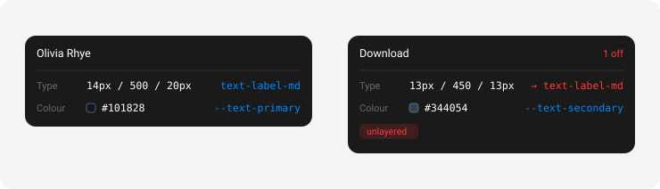

<div align="center">


# ds-lens

**Hover any element and find out whether it is actually on your design system.**

Which token. Which type role. Which cascade layer won.



<sub>MIT · zero runtime dependencies · React optional</sub>

</div>

---

## The problem

A design system can be present, correct, and have **no effect**.

Unlayered CSS outranks layered CSS whatever the specificity. So one legacy
stylesheet imported without `layer()` sits above every utility your system
emits — and adding a design-system class to an element does nothing. No error.
No warning. No visual change.

On the codebase this was built against, that was **1,590 typography rules**
outranking the entire design system, leaving **694 of 2,200 elements** on one
screen unreachable by it. It had been that way for months.

No inspector reports which layer won. This one does.

## Install

```bash
npm i -D ds-lens
```

```tsx
import { DsLens } from 'ds-lens'

<>
  <App />
  {import.meta.env.DEV && <DsLens />}
</>
```

That's it. Zero configuration on a Tailwind v4 project.

## Three surfaces, one reader

|  | For | How |
|---|---|---|
| **Overlay** | people | a draggable crosshair button |
| **`window.__dsLens`** | agents | plain JSON, no protocol |
| **`new Lens()`** | CI | fail a build when the count goes up |

All three call the same function, so the panel a designer reads and the numbers
an agent acts on can never disagree.

### Overlay

A 44px button you can drag anywhere; its position is remembered.

| Mode | How | Clicks |
|---|---|---|
| **Peek** | hold <kbd>⌥</kbd> / <kbd>Alt</kbd> | pass straight through |
| **Locked** | click the button | copy the reading |

A copied reading is four lines, not the raw object — the size it is actually
read at. Hold <kbd>⇧</kbd> while clicking for the full JSON instead.

```
"Aisha Rahman"  ·  div.convo-row > div > div > span
Type    14px / 600 / normal       ✗ nearest text-paragraph-md
Colour  #101828                   ✓ --foreground
Origin  inline style · UNLAYERED
```

Peek is the one to use alongside an annotation tool — look at an element, let
go, click it. <kbd>Esc</kbd> unlocks.

### Agent API

```js
__dsLens.readSelector('.contact-name')   // one element
__dsLens.readPoint(x, y)                 // pairs with an annotation's coords
__dsLens.audit()                         // every off-system value, grouped
__dsLens.audit({ root: 'table', properties: ['type'] })
__dsLens.roles()                         // what it thinks your ladder is
__dsLens.enrich(annotation)              // an annotation + what it measures
__dsLens.describe(reading)               // that reading as one readable line
```

`format(reading)` gives the four-line block instead of a single line.

Anything that can run a line of JavaScript in the page can use it — Playwright,
Puppeteer, a devtools console, an MCP browser tool, a bookmarklet.

### CI

```js
const { offSystem } = new Lens().audit({ properties: ['type'] })
if (offSystem > budget) process.exit(1)
```

A full-page audit runs in about **17ms**.

## Configuration

Everything is optional.

```tsx
<DsLens
  rolePattern={/^type-/}              // default /^text-[a-z][\w-]*$/
  tokenPrefixes={['--ds-']}           // default: every :root custom property
  properties={['color', 'gap']}       // default: type, colour, spacing, shape
  ignore={['.third-party-widget']}
  overlaySelectors={['#my-devtools']} // other floating UI to leave alone
  accent="#7C5CFF"
  exposeGlobal={false}                // default true
/>
```

Not using CSS classes for your type ladder? Declare it directly:

```tsx
roles={{ 'body-m': { fontSize: '14px', fontWeight: '500', lineHeight: '20px' } }}
```

## How discovery works

**Tokens** are read off `:root` — every declared custom property, resolved and
indexed the other way round, so `rgb(16, 24, 40)` can answer with
`--text-primary`. Aliases collapse; preference goes to the name that reads like
the property it serves, then to the shorter one.

**Type roles** are read from the *emitted CSS*, not from theme variables.
Tailwind v4's `@theme inline` inlines a role's value into the utility and never
emits the variable — reading `:root` on the project this was built for found
3 roles out of 9, each missing its weight. The utility rules are always there,
because they are what the browser applies.

**The winning rule** is computed the cascade's own way: `!important`, then layer
rank, then specificity, then document order — with layer rank inverted for
important declarations, which is the part people misremember.

## Alongside an annotation tool

ds-lens needs nothing else installed. But it plays well with
[agentation](https://agentation.com), Vercel Comments and friends, which tell an
agent *where* someone pointed without saying what that element measures.

**They don't fight.** While locked, ds-lens intercepts clicks — so it skips
known floating toolbars by default, and `overlaySelectors` adds your own.

**They cooperate through the page, not through each other.** Hand an
annotation to `enrich` and get it back with the measurement attached:

```js
import { enrich, describe } from 'ds-lens'

enrich(annotation)
// { comment: "this looks tight",
//   elementPath: "#page > .row > #btn",
//   dsLens: { type: {...}, readings: [...], offSystem: [...] } }

describe(enrich(annotation).dsLens)
// "14px / 500 / 20px · text-label-md · layer utilities"
// "13px / 450 / 13px · no role, nearest text-label-md · UNLAYERED"
```

`enrich` accepts `elementPath`, `selector`, `element` or `x`/`y`, so it works
with agentation, Vercel Comments and anything else that reports where a click
landed. ds-lens imports nothing from any of them. Both are on the global too —
`__dsLens.enrich(...)`, `__dsLens.describe(...)`.

If agentation happens to be on the page, ds-lens borrows its accent colour; if
not, it uses its own blue.

## Limits

- Reads what is in the document. A rule in an unloaded or cross-origin
  stylesheet is invisible.
- `@scope` proximity and transitions are not modelled in the cascade sort.
- Token matching is by resolved value. Two tokens sharing a value are genuinely
  ambiguous — narrow with `tokenPrefixes`.
- The overlay is React. The engine (`Lens`) is plain DOM with no React import
  and no module-level `document` access, so it runs under Node and during SSR.

## Development

```bash
npm i
npm run typecheck
npm run build     # tsup → ESM + CJS + .d.ts + sourcemaps
```

`prepublishOnly` runs both, so a package whose types don't compile can't ship.

Consuming it from a monorepo during development is easier through a source
alias than a `file:` dependency — you get hot reload and skip the rebuild:

```ts
// vite.config.ts
resolve: { alias: { 'ds-lens': '/abs/path/to/ds-lens/src/index.ts' } },
server:  { fs: { allow: ['.', '/abs/path/to/ds-lens'] } },
```

That second line matters. Vite refuses to serve files outside its root, and
without it the alias resolves, the request 404s, and the only symptom is a
component that never mounts.

## License

MIT
